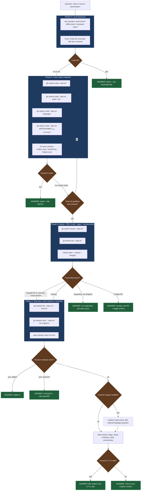

# Dep Recon

Three-phase probe of a dependency's GitHub repo to answer existence + capability questions with actual source, not speculation. Runs BEFORE context7 + web search.

## When to use

Any claim, assumption, or question about whether something exists or behaves a certain way in an external dep:

- "Does `<flag>` exist in `<tool>`?"
- "Is there a way to `<x>` in `<lib>`?"
- "What version added `<feature>`?"
- "Was `<thing>` removed from `<dep>`?"
- "Does `<lib>` support `<behavior>`?"
- Anytime training data may be stale for a fast-moving dep.
- A config var lookup

## The core rule

context7 + web results are derivatives + can be stale, summarized, or wrong. A `gh search code` hit in `main` settles the question. Only fall back to context7/web when all three GH passes return empty AND you've verified with qualifiers that empty really means empty.

Confidence gradient, highest to lowest:

  A: Local clone of the dep's repo / local offline docs (no truncation, no rate limit, no network)
  B: `gh search` hits in the official GH repo
  C: WebFetch of the dep's official docs page
  D: context7 (MUST be corroborated: see Fallback)
  E: Web search / blog posts / Stack Overflow

## Phase 0: Ask about local resources (before anything else)

Before any GH query, ASK the operator:

> "Do you have a local clone of `<owner>/<name>`, offline docs, or a vendored copy I should read first? (path, or 'no')"

If yes: use **Grep** directly on that path: same term variants you'd run on GH, no truncation, no rate limits, instant. Grep is the primary verb here; Read only to open a specific file after a Grep hit. A local match supersedes everything downstream (but verify it reflects a current branch, not a stale fork).

Example Grep shape for the local path:

```bash
# Grep tool calls: pseudocode
Grep(pattern="skip_output", path="/abs/path/to/local/lefthook", output_mode="content", -n=true)
Grep(pattern="skipOutput",  path="/abs/path/to/local/lefthook", output_mode="content", -n=true)
Grep(pattern="skip-output", path="/abs/path/to/local/lefthook", output_mode="content", -n=true)
```

If a local path is found, run `Grep` there FIRST with the same term variants you'd use on GH. Only escalate to GH when local comes up empty (or the operator confirms local is out-of-date relative to `main`).

## Truncation is the biggest footgun

GitHub code search caps results. **"No matches" often means "truncated", not "absent".** Never conclude absence without:

  A: Running the unqualified search AND at least two qualified variants
    1. `path:*.md` pass for docs
    2. `language:<expected>` pass for source
  B: Trying term variants (snake_case, camelCase, kebab-case, with/without prefix)
  C: Checking issues + releases before giving up

If you see an empty result on an unqualified search, that is a SIGNAL TO NARROW, not a conclusion.

## The flow



## Phase A: Code (latest snapshot)

Run in this order, stop when you have a confident answer:

```bash
# 1. unqualified baseline
gh search code '<term> repo:<owner>/<name>'

# 2. docs pass: catches README, CHANGELOG, docs/
gh search code '<term> repo:<owner>/<name> path:*.md'

# 3. source pass: narrow by language
gh search code '<term> repo:<owner>/<name> language:<go|ts|py|rs|...>'

# 4. path-scoped if monorepo
gh search code '<term> repo:<owner>/<name> path:packages/<sub>/'
```

**Variants matter.** `skip_output` vs `skipOutput` vs `skip-output` vs `SkipOutput`: search all plausible casings + delimiters.

## Phase B: Issues + PRs (intent, gaps, history)

Code shows what *is*. Issues show what was *wanted*, *rejected*, *removed*, or *planned*.

```bash
# open + closed issues
gh search issues '<term> repo:<owner>/<name>'

# PRs: in-flight or historical changes
gh search prs '<term> repo:<owner>/<name>'

# narrow to closed + merged to see what landed
gh search prs '<term> repo:<owner>/<name> is:merged'

# narrow to open for what's coming
gh search prs '<term> repo:<owner>/<name> is:open'
```

**Interpret results:**

- Open issue asking for `<term>` → feature doesn't exist, is requested
- Closed issue with a merged PR → exists, find the version (Phase C)
- Closed issue marked `wontfix` → explicitly rejected, cite the reasoning
- Merged PR referencing removal → feature was removed, cite version

## Phase C: Releases (when landed, when removed)

```bash
# recent release tags + dates
gh release list --repo <owner>/<name> --limit 20

# release notes for a specific tag
gh release view <tag> --repo <owner>/<name>

# dump all recent release bodies to temp/ for grep
gh release list --repo <owner>/<name> --limit 30 --json tagName \
  -q '.[].tagName' > temp/dep-recon-tags.txt
while read tag; do
  echo "=== $tag ==="
  gh release view "$tag" --repo <owner>/<name> --json body -q .body
done < temp/dep-recon-tags.txt > temp/dep-recon-notes.md
```

Then grep `temp/dep-recon-notes.md` for the term.

## Fallback: context7 + web

Only after all three phases return clean empties with qualifiers tried:

  A: context7 via MCP, if the plugin is installed: `query-docs` with natural-language question
  B: Web search for niche commentary, blog posts, Stack Overflow
  C: If still nothing, tell the operator "I don't know, couldn't confirm"

**Context7 is an optional dependency.** If the context7 plugin is not installed in this environment, skip step A and go straight to web search. The skill still works; you just lose one corroboration channel. Install at https://claude.com/plugins/context7.

**C7 alone is NEVER enough.** C7 truncates unpredictably: a C7 "miss" could mean the fact was simply cut from the returned chunk, not absent from the docs. If C7 returns nothing useful or something that looks incomplete, ALWAYS corroborate with at least one of: a second GH search pass with new term variants, a direct WebFetch of the relevant docs page, or a web search. Never conclude from C7 in isolation.

## Output format

Always cite source AND always include a navigable pointer for every piece of evidence: a clickable URL for remote sources, or an absolute source file path (`file:line`) for local hits. The operator must be able to click or open the path to verify. No bare issue numbers, tag names, or relative paths.

Shape of answer:

```text
<exists|doesn't exist|removed in vX.Y|coming in PR #N>

Evidence:
  - <short description> — <https://github.com/owner/repo/blob/<ref>/path/to/file.ext#L<line>>
  - <short description> — <https://github.com/owner/repo/issues/<N>> or /pull/<N>
  - <short description> — <https://github.com/owner/repo/releases/tag/<tag>>
  - <docs page title> — <https://official-docs.example.com/path>

Searched:
  - gh search code '...' (N hits)
  - gh search issues '...' (N hits)
  - gh release notes through <tag>
```

### URL shapes to use

- Code hit: `https://github.com/<owner>/<repo>/blob/<branch-or-sha>/<path>#L<line>` (use `main` if unsure of sha; prefer sha for pinned citations)
- Code hit with range: append `-L<end>` (e.g. `#L42-L58`)
- Issue: `https://github.com/<owner>/<repo>/issues/<N>`
- PR: `https://github.com/<owner>/<repo>/pull/<N>`
- Release: `https://github.com/<owner>/<repo>/releases/tag/<tag>`
- Commit: `https://github.com/<owner>/<repo>/commit/<sha>`
- Official docs: use the canonical URL the docs page resolves to (what WebFetch returned), not a search result

If a source has no public URL (local clone, offline docs), cite it as `local:<abs-path>:<line>` and note the source is local-only.

## Anti-patterns

- Concluding absence from one unqualified empty search
- Trusting context7/web over a clear GH code hit
- Skipping Phase B when code is empty: issues often explain WHY
- Searching only one casing/variant of the term
- Forgetting monorepo paths: search `path:packages/<name>/` when relevant

## Notes

- `gh search` requires `gh auth login`: already set up in this env
- Rate limits are generous but not infinite; prefer targeted queries over broad ones
- For archived/mirror repos, add `archived:false` to skip stale mirrors
- For orgs with many repos, `org:<name>` instead of `repo:` widens the net
