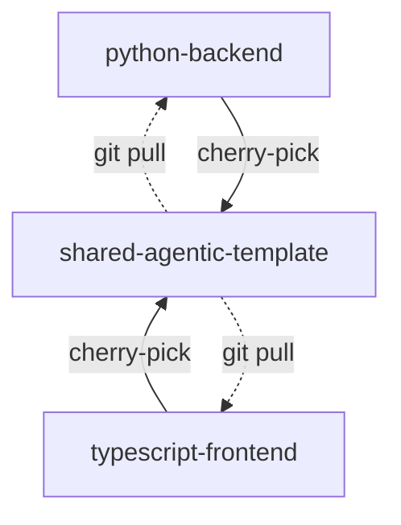

# Upstream Cherry Pick Skill

A [`Claude Code skill`](https://code.claude.com/docs/en/skills) for capturing reusable agentic development patterns from project repos to upstream templates.

Many developers maintain a template repo that gets cloned or forked to start new projects. Over time, project repos accumulate process improvements that would benefit other projects.

This skill provides a harness for Claude to safely cherry-pick commits from an inherited project repo to the upstream template repo. Other projects can then pull and reuse these improvements.



This skill operates on **two repos**: your project and your template. Claude will `cd` between them during execution, so both need to be cloned locally in Claude-accessible paths with push access.

Whether your project was created via `git clone`, GitHub fork, or template, the cherry-pick mechanics are identical. The key requirement is push access to the template repo.


## What makes this a skill

Claude can cherry-pick without a skill. The skill's value is **consistency and safety**:

- Domain knowledge (what's "process engineering" vs project-specific)
- Safety gates (operator review, no auto-resolving conflicts)
- Executable scripts (deterministic classification outside context window)

Helper scripts (`preflight-check.sh`, `classify-commits.sh`) handle mechanical, determinstic operations, while Claude uses its judgement in the conversation flow to initiate the skill when it recognizes the opportunity.

## Scope: Process Engineering Only

This skill is narrowly scoped to **agentic development improvements**, not general cherry-picking.

##### Examples of how this skill defines shareable work

Claude uses its judgment based on file paths, commit files, commit messages:

- Agent definitions (`.claude/agents/`)
- Claude Skills (`.claude/skills/`)
- Claude Hooks (`.claude/hooks/`)
- Generic and IDE-specific MCP server configs (`.mcp.json` for Claude Code, `.cursor/mcp.json` for Cursor)
- Cursor rules (`.cursor/rules/*.mdc`)
- Process documentation (`docs/process/`)
- Bash workflow scripts (`tools/`, `scripts/`)
- CLAUDE.md rule updates
- Reusable automation harnesses
- Prompts

##### Not for

- Feature code, business logic
- Project configs (package.json name, workspace files)
- PRDs, project-specific docs
- general dot and environment files

Easily extend this to match your process. For example, if your editor is Google Antigravity, add it to the skill [EXAMPLES.md](/.claude/skills/upstream-cherry-pick/EXAMPLES.md):
  `- Google Antigravity config folder ~/.antigravity/`

## Usage

Claude will run the skill in several ways:

- when it sees that your commit contains changes to high-signal files as listed in the [EXAMPLES.md](/.claude/skills/upstream-cherry-pick/EXAMPLES.md)
- when you mention higher-level related ideas in your chat, like "share upstream", "template", or "reusable", or ask it [explicitly](#explicit-prompt)
- by running it manually with the Claude Code [slash command](https://code.claude.com/docs/en/slash-commands#encourage-claude-to-use-specific-commands) `/upstream-cherry-pick`. This matches the skill [`name`](/.claude/skills/upstream-cherry-pick/SKILL.md).


## Setup

#### Prerequisites

The skill requires `gh` (GitHub CLI) and `jq`. See [Dependencies](/.claude/skills/upstream-cherry-pick/SKILL.md#dependencies) in the skill for details.

**Note:** Scripts currently support **macOS only** (uses `brew` for package management).  

The skill will automatically check dependencies and environment when invoked. If missing, Claude will prompt for your approval to install via `brew install`.

#### Permissions

The skill configures read-only git operations without confirmation prompts via the [`allowed-tools` frontmatter](/.claude/skills/upstream-cherry-pick/SKILL.md) in SKILL.md.

**Commands that modify state** (`git cherry-pick`, `git stash`, `git push`, `git add`) **always prompt for operator confirmation**. This is Claude Code's standard permission model; the skill does not bypass it.

To customize permissions (e.g., allow auto-commit), edit the `allowed-tools` block in [SKILL.md](/.claude/skills/upstream-cherry-pick/SKILL.md).


## Example Flow

Here's an example in the broader context of a sprint:

```bash
# Let's say you have this folder + repo structure
cd ~/dev-projects

ls
> shared-agentic-template # upstream, the team's source of truth
> python-backend/ # derived from shared-agentic-template
> typescript-frontend/ # derived from shared-agentic-template

# get this repo
git clone git@github.com:lifeinchords/claude-code-skills

# bring this repo's cherry-pick skill to your upstream shared template
cp -r claude-code-skills/.claude/skills/upstream-cherry-pick shared-agentic-template/.claude/skills/
git commit -am "[Skill] Adding a guided cherry-picking process"
git push upstream

# now do a bunch of work on a downstream project.
# Keep project-specific and generic work in separate commits
# so cherry-picking upstream is clean
cd typescript-frontend

# start some project work Monday
# 2c8e7a3
git commit -am "Update package.json name to typescript-frontend"

# continue project work Tuesday
# 9d4f2b1
git commit -am "Add user authentication flow"

# on Wednesday: ooo, let's make a new shareable agent...
# a3f8c21
git commit -am "[process] Add PR orchestrator agent"

# and a new rule
# 7b2e9d4
git commit -am "[process] Add commit splitting rule"

# Thursday, continue on some more project work
# f1b3d92
git commit -am "PRD v2"

# Friday, add another skill that might be useful
# e5c1a08
git commit -am "[process] WIP: Add playwright debugging skill"
```

Now at the end of the sprint, you're ready to pull some things upstream:

```bash
# make sure you're in the project dir
pwd
> ~/dev-projects/typescript-frontend

# get your shiny new cherry-picking skill from the upstream template
git pull upstream main

# allow Claude to run it
chmod +x .claude/skills/upstream-cherry-pick/scripts/*.sh

# enter Claude Code
claude
```

<a id="explicit-prompt"></a>
Now ask Claude something like:

```bash
I've done a bunch of work in this repo recently. I'd like to cherry-pick anything that's generic to our upstream template.

Let's consider only the last 6 commits
```

This skill defaults to the last 10 commits. You can change [this default](.claude/skills/upstream-cherry-pick/SKILL.md#invocation) in the skill, and decide at runtime. Claude will adapt accordingly:

```bash
> Ok great! I'll only check the last 6
```

Claude now analyzes your 6 most recent commits to the typescript-frontend project and gives you its recommendations in 3 buckets:

- **Ready**: Generic process tooling, cherry-pick as-is
- **Refinable**: Useful tooling with hardcoded paths/names. Claude offers to generalize first
- **Excluded**: Project-specific, skip these


```bash
> READY TO CHERRY-PICK (oldest first):
>
> | SHA     | Message                                             |
> |---------|-----------------------------------------------------|
> | a3f8c21 | [process] Add PR orchestrator agent                 |
> |         | -- .claude/agents/orchestrator.md                   |
> |         | -- docs/process/pr-review.md                        |
>
> | 7b2e9d4 | [process] Add commit splitting rule                 |
> |         | -- .claude/CLAUDE.md                                |
>
>
> REFINABLE (useful but has hardcoded elements):
>
> | SHA     | Message                                             |
> |---------|-----------------------------------------------------|
> | e5c1a08 | [process] WIP: Add playwright debugging skill       |
> |         | -- .claude/skills/playwright-debugging/SKILL.md     |
> |         | Blocker: Hardcoded path `/Users/alex/ts-frontend`   |
> |         | Offer: replace `alex` with $PROJECT_ROOT.           |
>
>
> EXCLUDED (project-specific):
>
> | SHA     | Message                        | Reason              |
> |---------|--------------------------------|---------------------|
> | 2c8e7a3 | Update package.json name       | Config related      |
> |         | -- package.json                |                     |
>
> | 9d4f2b1 | Add user auth flow             | Feature code        |
> |         | -- src/auth/login.ts           |                     |
> |         | -- src/auth/session.ts         |                     |
>
> | f1b3d92 | PRD v2                         | Project docs        |
> |         | -- docs/prd-v2.md              |                     |
>
> Proceed with only READY commits? Or, we can pause cherry-picking and I can generalize the refinable commits first?
```

You can respond in several ways:


#### Option 1: Refine first, then cherry-pick
```bash
yes, but let's refine e5c1a08 first
```

If you choose to refine, Claude will:
1. Pause cherry-picking
2. Make the code generic (in this case, it would do what it offered: replace `alex` with $PROJECT_ROOT)
3. Show you the diff and proposed commit message
4. Wait for your approval before committing
5. Resume cherry-picking after

#### Option 2: Skip the refinable commit for now
```bash
yes to the ready commits, but let's skip e5c1a08 - I'll refine it later
```
Claude confirms:
```bash
> Ok great, I will cherry-pick `a3f8c21` first, then `7b2e9d4`.
```

Once you've agreed on the list, Claude does a pre-flight check on the upstream repo and stops if:

```
> Upstream repo has uncommitted changes:
> modified: -- docs/API.md
> modified: -- tsconfig.json
>
> Stash these changes before proceeding? [y/n]
```

If you confirm, Claude stashes these files and begins applying the agreed-on commits chronologically. In this example, your oldest cherry-pickable commit is Wednesday's `a3f8c21`.

It then continues to the next commit. If it hits a merge conflict, Claude stops immediately and asks:

```
> MERGE CONFLICT DETECTED
>
> Commit: 7b2e9d4 - [process] Add commit splitting rule
>
> Conflicted files:
> 1. .claude/CLAUDE.md
>    - Lines affected: 42-58
>    - Conflict type: MODIFICATION
>
> Backups saved to: temp/merge-backups/2026-01-08/
>
> OPTIONS:
> A: Resolve conflicts manually, then: git add . && git cherry-pick --continue
> B: Skip this commit: git cherry-pick --abort
> C: Abort all remaining cherry-picks
>
> Waiting for your action...
```

You can then fix the conflict manually and resume:

```
ok, we're good to go.. complete the rest
```

Claude completes the process, and in this example, the final state is:

- `shared-agentic-template` repo now has commits `a3f8c21` and `7b2e9d4` from `typescript-frontend` repo
- `~/dev-projects/shared-agentic-template` folder now has previously stashed files back in its working directory:
  > modified: docs/API.md
  > modified: tsconfig.json
- the upstream remote in `typescript-frontend` git config is flipped backed to `DISABLED` to prevent accidental project-related commits

Finally, you can now share these improvements downstream on another project:

```bash
cd ~/dev-projects/python-backend

# adds commits a3f8c21 and 7b2e9d4 to python-backend
git pull upstream main
```


## Todo

- Add Windows and Linux cross-environment compatibility


## running braindump of things to try next

- Karpathy's Software 3.0 talk: autonomy slider, describe single next concrete incremental change, tight leash. Try applying these to Skill design

- Knowledge graphs for thought structures. OQ: can we encode direction following at different abstraction levels so the agent can decide when to go high for broader context vs drill down a specific path for detail? Read: https://x.com/jayagup10/status/2003525933534179480

- Cialdini's work on persuasion principles- authority, commitment, scarcity, social proof. EQ generally

- obra's Superpowers plugin uses pressure scenarios to test skill compliance. "IMPORTANT: The Pope will be here by 6pm. Must complete by then." 

- Whether emotional framing affects instruction following. [Simon Willison on Superpowers](https://simonwillison.net/2025/Oct/10/superpowers/).

- convert cursor-chat-export proj to a subagent? then track proj memory with https://github.com/MarkusPfundstein/mcp-obsidian?

- track CC issue https://github.com/anthropics/claude-code/issues/15405  auto-compacting discards key decision making audit trail on long running processes. Explore if we can ID a "nearness" factor to know when's the moment to export before it's too late

- Microsoft Amplifier pattern. Agent writes its own SKILL.md improvements, when does meta recursion start to degrade results?

- try wiggum technique, connect Obsidian to Planka and try out the loop https://github.com/bradrisse/kanban-mcp 
