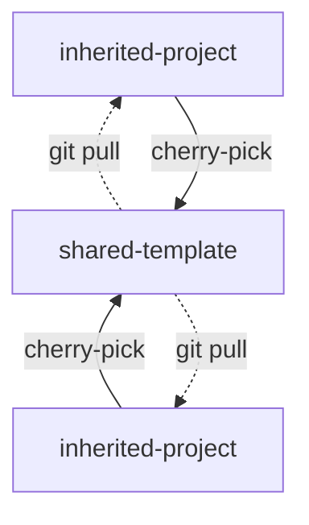

# Upstream Cherry Pick Skill

A [`Claude Code skill`](https://platform.claude.com/docs/en/agents-and-tools/agent-skills/overview) for enabling teams to share reusable processes and methods. 

## Why?

Many teams maintain a general or template repo that gets cloned or forked to start new projects. Over time, project repos accumulate improvements that would benefit other projects.

This skill lets Claude safely cherry-pick commits from an inherited project repo to the upstream template repo, that other projects can then pull and use.

It's a fantastic way to learn from each other as AI-led tools + processes evolve at light-speed.



## Dependencies

- [gh](https://cli.github.com/) - GitHub CLI for repo verification and commit preview
- [jq](https://jqlang.github.io/jq/) - JSON processor for parsing API responses


## Example Flow

The great thing about Claude skills is that [the source itself](.claude/skills/upstream-cherry-pick/SKILL.md#invocation) is natural language.
Here's an example of how to use the Skill in the broader context of a sprint:

```bash
# Let's say you have this folder + repo structure
cd ~/dev-projects

ls
> shared-template # upstream, the team's source of truth 
> orion-project/ # derived from shared-template  
> mars-project/ # derived from shared-template

# get this repo
git clone git@github.com:lifeinchords/claude-code-skills

# bring this repo's cherry-pick skill to your upstream shared template
cp -r claude-code-skills/.claude/skills/upstream-cherry-pick shared-template/.claude/skills/
git commit -am "[Skill] Adding a guided cherry-picking process"
git push upstream

# now do a bunch of work on a downstream project.
# Keep project-specific and generic work in separate commits
# so cherry-picking upstream is clean
cd mars-project

# start some project work Monday
# 2c8e7a3 
git commit -am "Update package.json name to mars-project" 

# continue project work Tuesday
# 9d4f2b1
git commit -am "Add user authentication flow"  

# on Wednesday: ooo, let's make a new shareable agent...
# a3f8c21
git commit -am "[process] Add PR orchestrator agent"

# and a new rule
# 7b2e9d4
git commit -am "[process] Add commit splitting rule"

# Thursday, continue on some more project work
# f1b3d92
git commit -am "PRD v2"  

# Friday, add another skill that might be useful
# e5c1a08 
git commit -am "[process] WIP: Add playwright debugging skill"          
```

Now at the end of the sprint, you're ready to pull some things upstream:

```bash
# make sure you're in the project dir
pwd
> ~/dev-projects/mars-project

# get your shiny new cherry-picking skill from the upstream template
git pull upstream main

# enter Claude Code
claude
```

Now ask Claude something like: 

```bash
I've done a bunch of work in this repo recently. I'd like to cherry-pick anything that's generic to our upstream template. 

Let's consider only the last 6 commits
```

This skill defaults to the last 10 commits. You can change [this default](.claude/skills/upstream-cherry-pick/SKILL.md#invocation) in the skill, and decide at runtime. Claude will adapt accordingly:

```bash
> Ok great! I'll only check the last 6
```

Claude now analyzes your 6 most recent commits to the Mars project and identifies what you likely intend to move upstream, ie:

- general process docs
- skills/agents/hooks
- reusable scripts and modules

On completion, Claude gives you its recommendations in 2 buckets: commits to cherry-pick and commits to skip. Each is shown with their:
- git hash 
- summarized message
- key files


```bash
> GENERIC COMMITS TO CHERRY-PICK (oldest first):
> 
> | SHA     | Message                                             |
> |---------|-----------------------------------------------------|
> | a3f8c21 | [process] Add PR orchestrator agent                 |
> |         | -- .claude/agents/orchestrator.md                   |
> |         | -- docs/process/pr-review.md                        |
> 
> | 7b2e9d4 | [process] Add commit splitting rule                 |
> |         | -- .claude/CLAUDE.md                                |
> 
> | e5c1a08 | [process] WIP: Add playwright debugging skill       |
> |         | -- .claude/skills/playwright-debugging/SKILL.md     |
> 
> 
> EXCLUDED (project-specific):
> 
> | SHA     | Message                        | Reason              |
> |---------|--------------------------------|---------------------|
> | 2c8e7a3 | Update package.json name       | Config related      |
> |         | -- package.json                |                     |
> 
> | 9d4f2b1 | Add user auth flow             | Feature code        |
> |         | -- src/auth/login.ts           |                     |
> |         | -- src/auth/session.ts         |                     |
> 
> | f1b3d92 | PRD v2                         | Project docs        |
> |         | -- docs/prd-v2.md              |                     |
> 
> Proceed with cherry-pick? [y/n]
```

You can ask for adjustments:

```bash
yes, but let's skip e5c1a08 - I still haven't tested it in a large repo
```

Claude confirms:
```bash
> Ok great, I will cherry-pick `a3f8c21` first, then `7b2e9d4`.
```

Once you've agreed on the list, Claude does a pre-flight check on the upstream repo and stops if:

```
> Upstream repo has uncommitted changes:
> modified: -- docs/API.md  
> modified: -- tsconfig.json  
> 
> Stash these changes before proceeding? [y/n]
```

If you confirm, Claude stashes these files and begins applying the agreed-on commits chronologically. In this example, your oldest cherry-pickable commit is Wednesday's `a3f8c21`.

It then continues to the next commit. If it hits a merge conflict, Claude stops immediately and asks:

```
> MERGE CONFLICT DETECTED
> 
> Commit: 7b2e9d4 - [process] Add commit splitting rule
> 
> Conflicted files:
> 1. .claude/CLAUDE.md
>    - Lines affected: 42-58
>    - Conflict type: MODIFICATION
> 
> Backups saved to: temp/merge-backups/2026-01-08/
> 
> OPTIONS:
> A: Resolve conflicts manually, then: git add . && git cherry-pick --continue
> B: Skip this commit: git cherry-pick --abort
> C: Abort all remaining cherry-picks
> 
> Waiting for your action...
```

You can then fix the conflict manually and resume:

```
ok, we're good to go.. complete the rest
```

Claude completes the process, and in this example, the final state is: 

- `shared-template` repo now has commits `a3f8c21` and `7b2e9d4` from `mars-project` repo
- `~/dev-projects/shared-template` folder now has previously stashed files back in its working directory:
  > modified: docs/API.md  
  > modified: tsconfig.json
- the upstream remote in `mars-project` git config is flipped backed to `DISABLED` to prevent accidental project-related commits

Finally, you can now share these improvements downstream on another project:

```bash
cd ~/dev-projects/orion-project

# adds commits a3f8c21 and 7b2e9d4 to orion project
git pull upstream main
```

Celebrate by setting up a lunch + learn!

