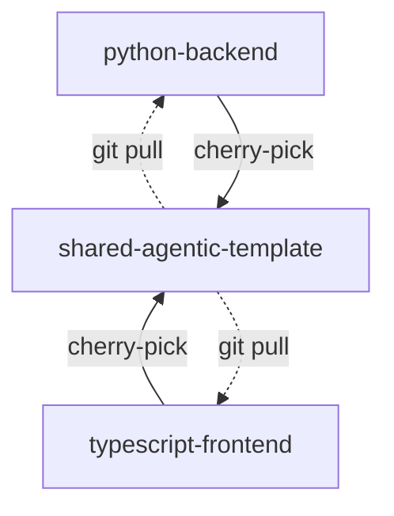

# Cherry-Pick Agentic Patterns Skill

A [`Claude Code Skill`](https://code.claude.com/docs/en/skills) for bringing reusable agentic dev patterns from project repos to your upstream template.

## Why?

Developers often maintain a template repo that gets cloned or forked to start new projects. Over time, downstream project repos accumulate process improvements that would benefit other projects.

This skill provides a harness for Claude Code to safely cherry-pick commits from an inherited project repo to its upstream template repo.



This skill operates on **two repos**: your **project** and your **template.** Claude will `cd` between them during execution, so both need to be cloned locally in Claude-accessible paths with push access.

Whether your project was created via `git clone`, GitHub fork, template copy, or manual file copy, the cherry-pick mechanics are identical. The key requirement is push access to the template repo.

## What makes this a skill

Claude can cherry-pick well without a skill, so why use this? The value is **consistency and safety**:

- Domain knowledge (what's "process engineering" vs project-specific)
- Consistent + reliable safety gates (operator review, no auto-resolving conflicts)
- External helper scripts: (`preflight-check.sh`, `classify-commits.sh`) handle mechanical, deterministic operations. This saves lots of precious tokens that don't need to be in the invoking chat's context window.

## How this skill determines what to cherry-pick

Claude uses its judgment to identify and extract reusable **agentic engineering patterns** (anything related to agents, skills, hooks, agentic-focused docs, MCP configs, AI workflow scripts ), while ignoring feature code and project-specific changes. See full classification details in [EXAMPLES.md](/.claude/skills/upstream-cherry-pick/EXAMPLES.md). 

This skill focuses on Cursor and Claude Code tooling, but it should broadly recognize others too. If needed, add an example, ie: `Google Antigravity configs (~/.antigravity/)`

## Usage

You can run the skill at any time, but the magic is once it's set up, Claude Code **proactively watches your work** and suggests running this skill when it notices opportunities to share patterns upstream. 

**Claude automatically proposes this skill:**
- After you push commits touching high-signal paths (`.claude/`, `.cursor/rules/`, MCP configs, etc.)
- In sprint/milestone reviews chats
- When you set up new agentic tooling (agents, skills, hooks, workflow scripts)

**You can also invoke it manually:**
- Mention words or phrases like "share upstream" or "template" in conversation
- Run the slash command `/upstream-cherry-pick` explicitly
- Ask Claude to check recent commits for shareable patterns

## Setup

### Prerequisites

This skill is currently **macOS only**. Claude will check for its dependencies when invoked: [`git`](https://git-scm.com/install), [`jq`](https://github.com/jqlang/jq), [`brew`](https://brew.sh/) and [`gh`](https://cli.github.com/). If any are missing, you'll be prompted to let Claude install them. See [Dependencies](/.claude/skills/upstream-cherry-pick/SKILL.md#dependencies).

### Permissions & safety

Read-only git operations defined in [SKILL.md's `allowed-tools`](/.claude/skills/upstream-cherry-pick/SKILL.md:6) let Claude bypass confirmation prompts.

This skill, however, is designed to **always prompt for confirmation when running commands that modify state** (ie, `git cherry-pick`, `git stash`, `git push`, `git add`).

To relax these guardrails, you'll need to align 2 things:
- update the `allowed-tools` 
- remove or rephrase safety gate instructions like "Do NOT auto-resolve conflicts" in [SKILL.md:338](/.claude/skills/upstream-cherry-pick/SKILL.md#L338)

If Claude runs into conflicing instructions, it will follow the more restrictive path.

## Example flow

Here's a full example in the broader context of a sprint:

### Sprint Timeline

```sh
# Let's say you have this folder + repo structure
cd ~/dev-projects

ls
> shared-agentic-template/   # upstream, your source of truth
> python-backend/            # derived from shared-agentic-template
> typescript-frontend/       # derived from shared-agentic-template

# get this repo
git clone git@github.com:lifeinchords/claude-code-skills

# bring this repo's cherry-pick skill to your shared template
cp -r claude-code-skills/.claude/skills/upstream-cherry-pick shared-agentic-template/.claude/skills/
git commit -am "[Skill] Adding an agentic pattern cherry-picking process"
git push upstream

# now bring your shiny new skill down from the upstream template
cd ~/dev-projects/typescript-frontend
git pull upstream main

# allow Claude to execute the skill
chmod +x .claude/skills/upstream-cherry-pick/scripts/*.sh

# now say you begin the sprint on typescript-frontend project,
# doing your best to keep project-specific and generic work 
# isolated in separate commits
claude 

# start some project work Monday
# 2c8e7a3
git commit -am "Update package.json name to typescript-frontend"

# continue project work Tuesday
# 9d4f2b1
git commit -am "Add user authentication flow"

# on Wednesday: ooo, let's make a new shareable agent...
# a3f8c21
git commit -am "[process] Add PR orchestrator agent"

# and a new rule
# 7b2e9d4
git commit -am "Add commit splitting rule"

# Thursday, continue on some project planning + docs
# f1b3d92
git commit -am "PRD v2"

# Friday, add another skill that might be useful
# e5c1a08
git commit -am "[process] WIP: Add Playwright debugging skill"
```

### Skill Invocation

After pushing commit `e5c1a08` on Friday, you say to Claude:

```sh
ok, wrapped up the sprint. Let's update the Trello board
```

Claude responds:

```sh
> Before we update Trello, since you mentioned we are done—
> I can use the upstream-cherry-pick skill to identify and bring shareable agentic patterns
> upstream to your template. Would you like me to run it?
```

**But how did it know *now* is a good time to prompt you about this skill?** 

The **metadata** for all the skills defined in your project's persists in every Claude Code session. It recognized the opportunity because it connects the dots via the criteria we described in [this skill's `description`](/.claude/skills/upstream-cherry-pick/SKILL.md:3):

  > Cherry-pick agentic patterns from project repos to upstream templates. WHEN TO PROPOSE: (1) After pushing commits touching high-signal paths, (2) Sprint/milestone review, (3) When agentic tooling is created. Classify commits as: YES (portable), MAYBE (needs changes/judgment—offer to fix), or NO (project-specific). YES examples: .claude/ (agents, skills, hooks, prompts), .cursor/rules/, MCP configs, docs/process/, CLAUDE.md, workflow scripts. NOT FOR: feature code, business logic, PRDs, project configs, env files. For MAYBE commits: present with "Offer:" describing what needs fixing

You respond:

```sh
oh, good idea, ok.. let's only check this week's commits
```

The skill [defaults to the last 10 commits](.claude/skills/upstream-cherry-pick/SKILL.md#invocation), but Claude adapts to your request, understanding you made 6 commits to `typescript-frontend` this week. 

It invokes this skill and presents recommendations in 3 buckets:

- **YES**: process engineering tooling that's portable, cherry-pick as-is
- **MAYBE**: candidates that need changes or judgment, with update proposals
- **NO**: Project-specific code, skip these

### Recommendations

```sh
> CHERRY PICK RECOMMENDATION (oldest first):
> 
> YES (cherry-pick as-is):
> | SHA     | Message                                             |
> |---------|-----------------------------------------------------|
> | a3f8c21 | [process] Add PR orchestrator agent                 |
> |         | -> .claude/agents/orchestrator.md                   |
> |         | -> docs/process/pr-review.md                        |
> | 7b2e9d4 | [process] Add commit splitting rule                 |
> |         | -> .claude/CLAUDE.md                                |
> 
> MAYBE (needs changes or judgment):
> | SHA     | Message                                | Offer                    |
> |---------|----------------------------------------|--------------------------|
> | e5c1a08 | Add Playwright debugging skill         | Parameterize path        |
> |         | -> .claude/skills/playwright/SKILL.md  | /Users/alex -> $PROJECT  |
> 
> NO (project-specific):
> | SHA     | Message                        | Reason              |
> |---------|--------------------------------|---------------------|
> | 2c8e7a3 | Update package.json name       | Config change       |
> |         | -> package.json                |                     |
> | 9d4f2b1 | Add user auth flow             | Feature code        |
> |         | -> src/auth/login.ts           |                     |
> |         | -> src/auth/session.ts         |                     |
> | f1b3d92 | PRD v2                         | Project docs        |
> |         | -> docs/prd-v2.md              |                     |
> 
> Proceed?

```

### Choose your adventure

**Option 1: Cherry-pick all the proposed commits**
```sh
proceed with all the YESes
```

**Option 2: Fix a MAYBE commit first, then cherry-pick**
```sh
let's fix the MAYBE e5c1a08 now
```

Claude will then:
1. Pause the cherry-pick workflow
2. Make the fix (in this case: replace `/Users/alex/dev-projects/typescript-frontend` with `$PROJECT`)
3. Show you the diff and proposed commit message
4. Wait for your approval before committing
5. Resume cherry-picking after

**Option 3: Skip MAYBE commits**
```sh
yes to all the YES commits and skip the MAYBE ones
```

**Option 4: Stop**
```sh
actually, changed my mind. Let's go back to Trello stuff
```

### What Happens Next

Say you go with Option 3, `Skip MAYBE commits`. Claude confirms which commits will be cherry-picked:
```sh
> Ok, I'll cherry-pick a3f8c21 and 7b2e9d4
```

It does its pre-flight check on the upstream repo, finds a blocker and stops:

```sh
> Upstream repo has uncommitted changes:
> modified: -- docs/API.md
> modified: -- tsconfig.json
>
> Stash these changes before proceeding? [y/n]
```

If you confirm, Claude stashes these files and begins applying the agreed-on commits chronologically. In this example, your oldest cherry-pickable commit is Wednesday's `a3f8c21`.

It then continues to the next commit. If Claude hit a merge conflict, it stops immediately, summarizes the issue and asks you what to do:

```sh
> MERGE CONFLICT DETECTED
>
> Commit: 7b2e9d4 - [process] Add commit splitting rule
>
> Conflicted files:
> 1. .claude/CLAUDE.md
>    - Lines affected: 42-58
>    - Conflict type: MODIFICATION
>
> Backups saved to: temp/merge-backups/2026-01-08/
>
> OPTIONS:
> A: Resolve conflicts manually, then: git add . && git cherry-pick --continue
> B: Skip this commit: git cherry-pick --abort
> C: Abort all remaining cherry-picks
>
> Waiting for your action...
```

You can then fix the conflict manually and resume:

```sh
ok, I fixed the issue on my end. we're good to go.. complete the rest
```

### Outcome

Claude completes the process, resulting with:

- the upstream `shared-agentic-template` repo now has commits `a3f8c21` and `7b2e9d4` from the downstream `typescript-frontend` project repo

- `~/dev-projects/shared-agentic-template` folder now has previously stashed files back in its working directory:
  ```sh
  > modified: docs/API.md
  > modified: tsconfig.json
  ```

- in the `typescript-frontend` project, the `upstream` remote (pointing to `shared-agentic-template`) is flipped back to `push-disabled` so you can't accidentally push project code to the template.


You can now share these improvements downstream on any derived project:

```sh
cd ~/dev-projects/python-backend

# adds commits a3f8c21 and 7b2e9d4 to python-backend
git pull upstream main
```

## Todo

- Extract more determinsitic parts of the skill to helpers to reduce the SKILL.md size
- Add Windows and Linux cross-environment compatibility
- Make helper scripts shell-agnostic, ie fish, zsh

## braindump of things to try next

- Karpathy's Software 3.0 talk: autonomy slider, describe single next concrete incremental change, tight leash. Try applying these to Skill design

- Knowledge graphs for thought structures. OQ: can we encode direction following at different abstraction levels so the agent can decide when to go high for broader context vs drill down a specific path for detail? Read: https://x.com/jayagup10/status/2003525933534179480

- Cialdini's work on persuasion principles- authority, commitment, scarcity, social proof. EQ generally

- obra's Superpowers plugin uses pressure scenarios to test skill compliance. "IMPORTANT: The Pope will be here by 6pm. Must complete by then." 

- Whether emotional framing affects instruction following. [Simon Willison on Superpowers](https://simonwillison.net/2025/Oct/10/superpowers/).

- convert cursor-chat-export proj to a subagent? then track proj memory with https://github.com/MarkusPfundstein/mcp-obsidian?

- track CC issue https://github.com/anthropics/claude-code/issues/15405  auto-compacting discards key decision making audit trail on long running processes. Explore if we can ID a "nearness" factor to know when's the moment to export before it's too late

- Microsoft Amplifier pattern. Agent writes its own SKILL.md improvements, when does meta recursion start to degrade results?

- try wiggum technique, connect Obsidian to Planka and try out the loop https://github.com/bradrisse/kanban-mcp 
